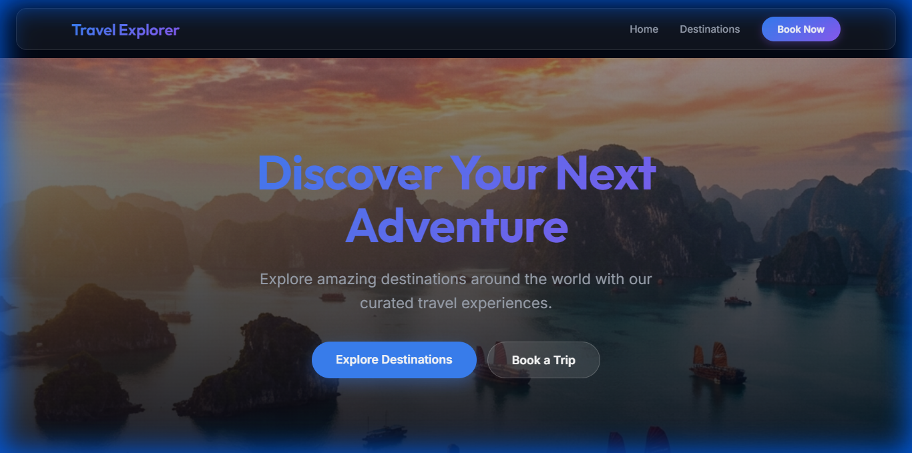
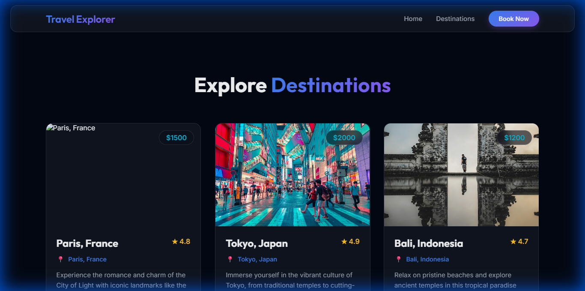
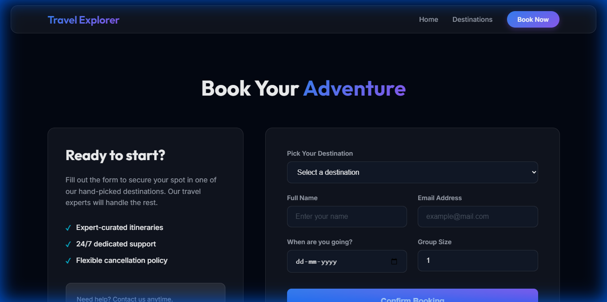
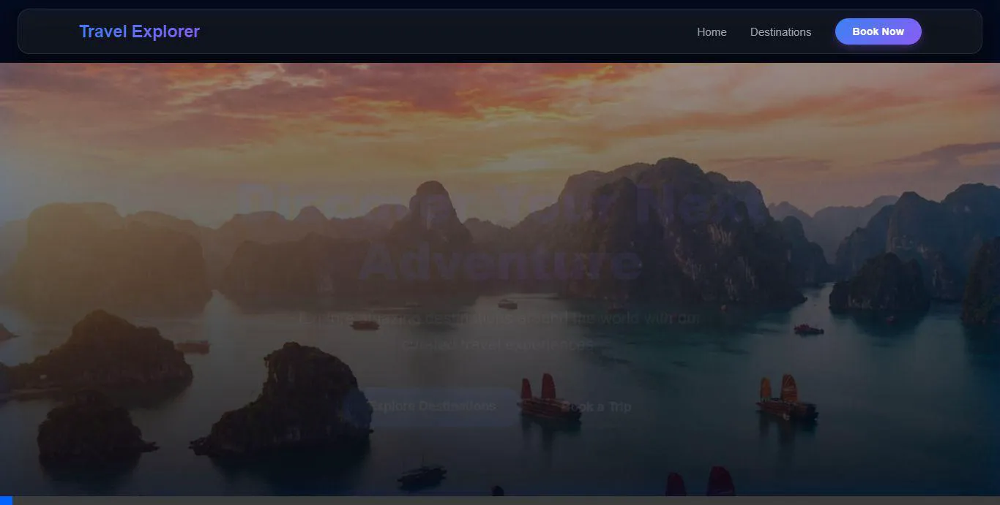

# Travel Explorer 🌍

A premium, full-stack travel booking platform featuring a cinematic UI, glassmorphism design, and integrated booking management.

## 🚀 Experience the New Design

Our latest update introduces a premium dark-themed experience with immersive visuals and smooth interactions.

### Cinematic Hero & Global Layout



### Curated Destinations



### Modern Booking System



### UI Walkthrough



### Secure Authentication

- **User Management**: Integrated generic Clerk authentication for secure sign-in/up.
- **Protected Routes**: Booking flow is secured for authenticated users only.
- **Seamless Integration**: "Sign In" and User Profile components embedded in the header.

---

## 🛠️ Project Structure

The project consists of a high-performance backend and a dynamic React frontend:

- **`backend/`**: Node.js & Express server connected to MongoDB.
- **`frontend/`**: React.js application with a premium glassmorphism design system.
- **`docs/assets/`**: Project visuals and documentation assets.

## ⚙️ Tech Stack

- **Frontend**: React 19, React Router 7, Vanilla CSS (Glassmorphism).
- **Backend**: Node.js, Express, Mongoose.
- **Database**: MongoDB (Local/Atlas).
- **Design**: Google Fonts (Outfit & Inter), Cinematic Photography, Custom Animations.

## 🚀 Deployment

### GitHub
1. Initialize git and commit:
   ```bash
   git init
   git add .
   git commit -m "Initial commit"
   ```
2. Create a repository on GitHub and push:
   ```bash
   git remote add origin <your-repo-url>
   git push -u origin main
   ```

### Vercel
1. Install Vercel CLI or import your GitHub repo on [Vercel Dashboard](https://vercel.com).
2. Add Environment Variables in Vercel Project Settings:
   - `MONGODB_URI` (Your MongoDB Atlas connection string)
   - `REACT_APP_CLERK_PUBLISHABLE_KEY` (Frontend)
   - `CLERK_SECRET_KEY` (Backend)
   - `CLERK_PUBLISHABLE_KEY` (Backend)

3. Deploy:
   ```bash
   vercel
   ```
   The included `vercel.json` handles the configuration for both frontend and backend.

## 🏁 Getting Started

### Prerequisites

- Node.js (v16+)
- MongoDB running locally (default: `mongodb://localhost:27017/travel`)

### Installation

1. **Clone the repository**
2. **Setup Backend**
   ```bash
   cd backend
   npm install
   npm run seed  # To populate sample data
   npm start
   ```

3. **Setup Frontend**
   ```bash
   cd ../frontend
   npm install
   npm start
   ```

Open [http://localhost:3000](http://localhost:3000) to explore your next adventure!

---

*Redesigned with ❤️ for a better travel experience.*
